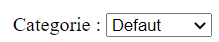

# Les composants de liste pour formulaire

## ZoneSelect

### Présentation

Affiche une liste déroulante pour sélectionner une seule valeur. Correspond au tag HTML \<select\>.

```php
$comp = $filtre->DeclareComposant("\Pv\ZoneWeb\FiltreDonnees\Composant\ZoneSelect") ;
$comp->FournisseurDonnees = new \Pv\FournisseurDonnees\Direct() ;
$comp->FournisseurDonnees->Valeurs["categories"] = array(
	array("id" => 1, "titre" => "Defaut"),
	array("id" => 2, "titre" => "Livre"),
	array("id" => 3, "titre" => "Tableau"),
	array("id" => 4, "titre" => "Calendrier"),
) ;
$comp->NomColonneValeur = "id" ;
$comp->NomColonneLibelle = "titre" ;
```



### Propriétés/Méthodes d'initiation

Propriété | Description
------------- | -------------
$NomColonneLibelle | Nom de la colonne pour l'étiquette de chaque option
$NomColonneValeur | Nom de la colonne pour la valeur de chaque option
$InclureElementHorsLigne | Inclure dans le rendu une option vide.
$ValeurElementHorsLigne | Valeur de l'option vide. Par défaut, c'est la valeur ""
$LibelleElementHorsLigne | Libellé éventuel de l'option vide. Par défaut, c'est la valeur ""

```php
$comp = $filtre->DeclareComposant("\Pv\ZoneWeb\FiltreDonnees\Composant\ZoneSelect") ;
...
$comp->InclureElementHorsLigne = true ;
$comp->LibelleElementHorsLigne = "(Tous)" ;
```


### Filtres de données

Ces composants contiennent des filtres de sélection, comme les tableaux de données.

```php
$comp = $filtre->DeclareComposant("\Pv\ZoneWeb\FiltreDonnees\Composant\ZoneSelect") ;
...
$flt = $comp->InsereFltSelectHttpGet("id", "id=<self>") ;
...
print $comp->FiltresSelection[0]->Lie() ;
```

Les méthodes pour insérer les filtres sont identiques.

Méthode | Description
------------- | -------------
InsereFltSelectHttpGet($nom, $exprDonnees='', $nomClsComp='') | Ajoute un filtre http GET
InsereFltSelectHttpPost($nom, $exprDonnees='', $nomClsComp='') | Ajoute un filtre http POST
InsereFltSelectHttpUpload($nom, $cheminDossierDest="", $exprDonnees='', $nomClsComp='') | Ajoute un filtre http UPLOAD. Tous les fichiers téléchargés seront déposés dans le dossier $cheminDossierDest.
InsereFltSelectSession($nom, $exprDonnees='', $nomClsComp='') | Ajoute un filtre contenant la valeur d'une session
InsereFltSelectFixe($nom, $valeur, $exprDonnees='', $nomClsComp='') | Ajoute un filtre basé sur une valeur fixe
InsereFltSelectCookie($nom, $exprDonnees='', $nomClsComp='') | Ajoute un filtre contenant la valeur d'un cookie

### Caractéristiques après rendu

Après le rendu, les éléments du composants sont disponibles dans la propriété $Elements.

```php
$this->FltCateg = $this->FormPrinc->InsereFltEditHttpPost("categorie", "categorie") ;
$this->CompCateg = $this->FltCateg->RemplaceComposant(new \Pv\ZoneWeb\FiltreDonnees\Composant\ZoneSelect()) ;
...
$ctn = $this->FormPrinc->RenduDispositif() ;
if(count($this->CompCateg->Elements) == 0)
{
	$ctn .= "Aucune categorie n'a été enregistrée..." ;
}
```

## ZoneSelectBool

Ce composant génère une liste avec uniquement les options "Oui"/"Non".

```php
$comp = $filtre->RemplaceComposant(new \Pv\ZoneWeb\FiltreDonnees\Composant\ZoneSelectBool()) ;
```


Ses propriétés importantes sont :

Méthode | Description
------------- | -------------
$LibelleVrai | Libelle pour l'option "Oui".
$LibelleFaux | Libelle pour l'option "Non".
$ValeurVrai | Valeur pour l'option "Oui". Par défaut, c'est 1.
$ValeurFaux | Valeur pour l'option "Non". Par défaut, c'est 0.

```php
$comp = $filtre->RemplaceComposant(new \Pv\ZoneWeb\FiltreDonnees\Composant\ZoneSelectBool()) ;
$comp->LibelleVrai = "Réussi" ;
$comp->LibelleFaux = "Echoué" ;
```


## ZoneBoiteOptionsCocher

Elle permet de sélectionner plusieurs valeurs. Pour les valeurs par défaut, dédiez une colonne.

```php
$comp = $filtre->DeclareComposant("\Pv\ZoneWeb\FiltreDonnees\Composant\ZoneBoiteOptionsCocher") ;
$comp->FournisseurDonnees = new \Pv\FournisseurDonnees\Direct() ;
$comp->FournisseurDonnees->Valeurs["categories"] = array(
	array("id" => 1, "titre" => "Defaut", "actif" => 1),
	array("id" => 2, "titre" => "Livre", "actif" => 0),
	array("id" => 3, "titre" => "Tableau", "actif" => 0),
	array("id" => 4, "titre" => "Calendrier", "actif" => 1),
) ;
$comp->NomColonneValeur = "id" ;
$comp->NomColonneLibelle = "titre" ;
```

Lorsque le formulaire sera soumis, les valeurs formeront une chaîne de caractère, fusionnées par ",".

