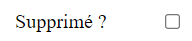

# Les composants de liste pour formulaire

## ZoneSelect

### Présentation

Affiche une liste déroulante pour sélectionner une seule valeur. Correspond au tag HTML \<select\>.

```php
$comp = $filtre->DeclareComposant("\Pv\ZoneWeb\FiltreDonnees\Composant\ZoneSelect") ;
$comp->FournisseurDonnees = new \Pv\FournisseurDonnees\Direct() ;
$comp->FournisseurDonnees->Valeurs["categories"] = array(
	array("id" => 1, "titre" => "Defaut"),
	array("id" => 2, "titre" => "Livre"),
	array("id" => 3, "titre" => "Tableau"),
	array("id" => 4, "titre" => "Calendrier"),
) ;
$comp->NomColonneValeur = "id" ;
$comp->NomColonneLibelle = "titre" ;
```


### Propriétés/Méthodes d'initiation

Propriété | Description
------------- | -------------
$NomColonneLibelle | Nom de la colonne pour l'étiquette de chaque option
$NomColonneValeur | Nom de la colonne pour la valeur de chaque option
$InclureElementHorsLigne | Inclure dans le rendu une option vide.
$ValeurElementHorsLigne | Valeur de l'option vide. Par défaut, c'est la valeur ""
$LibelleElementHorsLigne | Libellé éventuel de l'option vide. Par défaut, c'est la valeur ""

```php
$comp = $filtre->DeclareComposant("\Pv\ZoneWeb\FiltreDonnees\Composant\ZoneSelect") ;
...
$comp->InclureElementHorsLigne = true ;
$comp->LibelleElementHorsLigne = "(Tous)" ;
```


### Filtres de données

Ces composants contiennent des filtres de sélection, comme les tableaux de données.

```php
$comp = $filtre->DeclareComposant("\Pv\ZoneWeb\FiltreDonnees\Composant\ZoneSelect") ;
...
$flt = $comp->InsereFltSelectHttpGet("id", "id=<self>") ;
...
print $comp->FiltresSelection[0]->Lie() ;
```

Les méthodes pour insérer les filtres sont identiques.

Méthode | Description
------------- | -------------
InsereFltSelectHttpGet($nom, $exprDonnees='', $nomClsComp='') | Ajoute un filtre http GET
InsereFltSelectHttpPost($nom, $exprDonnees='', $nomClsComp='') | Ajoute un filtre http POST
InsereFltSelectHttpUpload($nom, $cheminDossierDest="", $exprDonnees='', $nomClsComp='') | Ajoute un filtre http UPLOAD. Tous les fichiers téléchargés seront déposés dans le dossier $cheminDossierDest.
InsereFltSelectSession($nom, $exprDonnees='', $nomClsComp='') | Ajoute un filtre contenant la valeur d'une session
InsereFltSelectFixe($nom, $valeur, $exprDonnees='', $nomClsComp='') | Ajoute un filtre basé sur une valeur fixe
InsereFltSelectCookie($nom, $exprDonnees='', $nomClsComp='') | Ajoute un filtre contenant la valeur d'un cookie

### Caractéristiques après rendu

Après le rendu, les éléments du composants sont disponibles dans la propriété $Elements.

```php
$this->FltCateg = $this->FormPrinc->InsereFltEditHttpPost("categorie", "categorie") ;
$this->CompCateg = $this->FltCateg->RemplaceComposant(new \Pv\ZoneWeb\FiltreDonnees\Composant\ZoneSelect()) ;
...
$ctn = $this->FormPrinc->RenduDispositif() ;
if(count($this->CompCateg->Elements) == 0)
{
	$ctn .= "Aucune categorie n'a été enregistrée..." ;
}
```

## ZoneSelectBool

Ce composant génère une liste avec uniquement les options "Oui"/"Non".

```php
$comp = $filtre->RemplaceComposant(new \Pv\ZoneWeb\FiltreDonnees\Composant\ZoneSelectBool()) ;
```


Ses propriétés importantes sont :

Propriété | Description
------------- | -------------
$LibelleVrai | Libelle pour l'option "Oui".
$LibelleFaux | Libelle pour l'option "Non".
$ValeurVrai | Valeur pour l'option "Oui". Par défaut, c'est 1.
$ValeurFaux | Valeur pour l'option "Non". Par défaut, c'est 0.

```php
$comp = $filtre->RemplaceComposant(new \Pv\ZoneWeb\FiltreDonnees\Composant\ZoneSelectBool()) ;
$comp->LibelleVrai = "Réussi" ;
$comp->LibelleFaux = "Echoué" ;
```


## ZoneBoiteOptionsCocher

### Présentation

Elle permet de sélectionner plusieurs valeurs, à partir de cases à cocher.

Avec la propriété $NomColonneValeurParDefaut, une colonne définit les options à cocher.

```php
$comp = $filtre->DeclareComposant("\Pv\ZoneWeb\FiltreDonnees\Composant\ZoneBoiteOptionsCocher") ;
$comp->FournisseurDonnees = new \Pv\FournisseurDonnees\Direct() ;
$comp->FournisseurDonnees->Valeurs["categories"] = array(
	array("id" => 1, "titre" => "Defaut", "actif" => 1),
	array("id" => 2, "titre" => "Livre", "actif" => 0),
	array("id" => 3, "titre" => "Tableau", "actif" => 0),
	array("id" => 4, "titre" => "Calendrier", "actif" => 1),
) ;
$comp->NomColonneValeur = "id" ;
$comp->NomColonneLibelle = "titre" ;
$comp->NomColonneValeurParDefaut = "actif" ;
```


### Propriétés / Méthodes principales

Méthode | Description | Valeur par défaut
------------- | ------------- | -------------
$CocherAutoPremiereOption | Coche automatiquement la 1ère option s'il n'y a aucune valeur. | true
$MaxColonnesParLigne | Nombre d'options max. par ligne | 2
$InclureLiens | Intégrer des liens pour cocher/décocher les options | true
$InclureLienSelectTous | Affichera également un lien pour cocher toutes les options | false
$LibelleLienSelectTous | Libellé du lien pour cocher toutes les options | Cocher tout
$InclureLienSelectAucun | Affichera également un lien pour décocher toutes les options | false
$LibelleLienSelectAucun | Libellé du lien pour décocher toutes les options | Décocher tout

```php
$comp->InclureLiens = true ;
$comp->InclureLienSelectTous = true ;
$comp->InclureLienSelectAucun = true ;
```


### Récupération des valeurs

Lorsque le formulaire sera soumis, les valeurs cochées formeront une chaîne de caractère, fusionnées par ",".

```php
$filtre = $form->InsereFltSelectHttpPost("categs", "categories") ;
$comp = $filtre->DeclareComposant("\Pv\ZoneWeb\FiltreDonnees\Composant\ZoneBoiteOptionsCocher") ;
$comp->FournisseurDonnees = new \Pv\FournisseurDonnees\Direct() ;
$comp->FournisseurDonnees->Valeurs["categories"] = array(
	array("id" => 1, "titre" => "Defaut", "actif" => 1),
	array("id" => 2, "titre" => "Livre", "actif" => 0),
	array("id" => 3, "titre" => "Tableau", "actif" => 0),
	array("id" => 4, "titre" => "Calendrier", "actif" => 1),
) ;
```

Dans ce cas, nous cochons ces valeurs "Livre", "Tableau" et "Calendrier" :


Avec l'outil de développement Google Chrome, le paramètre "categs" aura la valeur "2, 3, 4".


Pendant l'exécution de la commande, convertissez les valeurs du filtre dans un tableau.

```php
class Script1 extends \Pv\ZoneWeb\Script\Script
{
	public function DetermineEnvironnement()
	{
		$this->Form1 = $this->InsereFormPrinc() ;
		$this->Form1->InclureElementEnCours = false ;
		$this->Form1->NomClasseCommandeExecuter = "\Pv\ZoneWeb\Commande\AppliqueScriptParent" ;
		$this->Form1->ChargeConfig() ;
		$this->Flt1 = $this->Form1->InsereFltEditHttpPost("categs", "") ;
		$this->Flt1->Libelle = "Categorie :" ;
		$comp = $this->Flt1->DeclareComposant("\Pv\ZoneWeb\FiltreDonnees\Composant\ZoneBoiteOptionsCocher") ;
		...
	}
	public function AppliqueCommande(& $cmd)
	{
		// Récupérer toutes les options cochées dans 1 tableau
		if($this->Flt1->Lie() != "")
		{
			$categs = explode(", ", $this->Flt1->Lie()) ;
			foreach($categs as $i => $val)
			{
				...
			}
		}
	}
}
```

## ZoneBoiteOptionsRadio

Ce composant permet de cocher uniquement une option.

```php
$filtre = $this->Form1->InsereFltEditHttpPost("option1", "") ;
$filtre->Libelle = "Type :" ;
$comp = $filtre->DeclareComposant("\Pv\ZoneWeb\FiltreDonnees\Composant\ZoneBoiteOptionsRadio") ;
$comp->FournisseurDonnees = new \Pv\FournisseurDonnees\Direct() ;
$comp->FournisseurDonnees->Valeurs["categories"] = array(
	array("id" => 1, "titre" => "Appareil"),
	array("id" => 2, "titre" => "Meuble"),
	array("id" => 3, "titre" => "Journal"),
) ;
$comp->NomColonneValeur = "id" ;
$comp->NomColonneLibelle = "titre" ;
```


## ZoneCocherBool

Ce composant transmet une valeur positive (1) si l'option est cochée.

```php
$filtre = $this->Form1->InsereFltEditHttpPost("est_supprime", "") ;
$filtre->Libelle = "Supprimé ?" ;
$comp = $filtre->DeclareComposant("\Pv\ZoneWeb\FiltreDonnees\Composant\ZoneCocherBool") ;
```



Ses propriétés importantes sont :

Propriété | Description
------------- | -------------
$ValeurVrai | Valeur pour l'option "Oui". Par défaut, c'est 1.
$ValeurFaux | Valeur pour l'option "Non". Par défaut, c'est 0.

```php
$comp = $filtre->DeclareComposant("\Pv\ZoneWeb\FiltreDonnees\Composant\ZoneCocherBool") ;
$comp->ValeurVrai = 2 ;
```

## Voir aussi

- [Composants de saisie pour filtre de données](compsfrm_saisie.md)
- [Composants de rendu](composants_rendu.md)
- [Filtres de données](filtresdonnees.md)
- [Tableaux de données](tableauxdonnees.md)
- [Formulaires de données](formulairedonnees.md)


